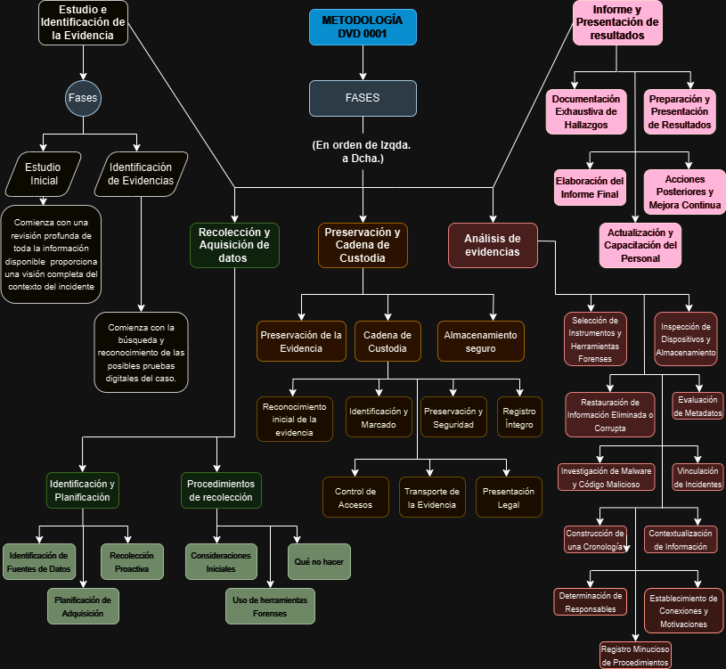

# P.01 - Development of a Forensic Analysis Methodology

## **Índice**

[Introducción](https://github.com/davidvila21/AF-DVD/blob/main/AF-P01-DVD.md#introducci%C3%B3n)          
[Análisis de Metodologías](https://github.com/davidvila21/AF-DVD/blob/main/AF-P01-DVD.md#an%C3%A1lisis-de-metodolog%C3%ADas)        
- [¿Cuáles he elegido y por qué?](https://github.com/davidvila21/AF-DVD/blob/main/AF-P01-DVD.md#cu%C3%A1les-he-elegido-y-por-qu%C3%A9)
- [NIST](https://github.com/davidvila21/AF-DVD/blob/main/AF-P01-DVD.md#1%C2%BA---nist)
- [ISO/IEC 27037:2012](https://github.com/davidvila21/AF-DVD/blob/main/AF-P01-DVD.md#2%C2%BA---isoiec-270372012)

[Comparativa entre ISO y NIST](https://github.com/davidvila21/AF-DVD/blob/main/AF-P01-DVD.md#comparativa-entre-iso-y-nist)

[Metodología Propia - DVD 0001](https://github.com/davidvila21/AF-DVD/blob/main/AF-P01-DVD.md#metodolog%C3%ADa-propia---dvd-0001)
- [Estudio e Identificación de la Evidencia](https://github.com/davidvila21/AF-DVD/blob/main/AF-P01-DVD.md#estudio-e-identificaci%C3%B3n-de-la-evidencia)
  - [Estudio Inicial](https://github.com/davidvila21/AF-DVD/blob/main/AF-P01-DVD.md#estudio-inicial)
  - [Identificación de Evidencias](https://github.com/davidvila21/AF-DVD/blob/main/AF-P01-DVD.md#identificaci%C3%B3n-de-evidencias)

- [Recolección y Adquisición de Datos](https://github.com/davidvila21/AF-DVD/blob/main/AF-P01-DVD.md#recolecci%C3%B3n-y-adquisici%C3%B3n-de-datos)
  - [Identificación y Planificación](https://github.com/davidvila21/AF-DVD/blob/main/AF-P01-DVD.md#1-identificaci%C3%B3n-y-planificaci%C3%B3n)
  - [Procedimientos de Recolección]()

- [Preservación y Cadena de Custodia](https://github.com/davidvila21/AF-DVD/blob/main/AF-P01-DVD.md#preservaci%C3%B3n-y-cadena-de-custodia)
  - [Preservación de la Evidencia](https://github.com/davidvila21/AF-DVD/blob/main/AF-P01-DVD.md#1-preservaci%C3%B3n-de-la-evidencia)
  - [Cadena de Custodia](https://github.com/davidvila21/AF-DVD/blob/main/AF-P01-DVD.md#2-cadena-de-custodia)
  - [Almacenamiento Seguro](https://github.com/davidvila21/AF-DVD/blob/main/AF-P01-DVD.md#3-almacenamiento-seguro)

- [Análisis de Evidencias](https://github.com/davidvila21/AF-DVD/blob/main/AF-P01-DVD.md#an%C3%A1lisis-de-evidencias)
- [Documentación y Presentación de Resultados](https://github.com/davidvila21/AF-DVD/blob/main/AF-P01-DVD.md#documentaci%C3%B3n-y-presentaci%C3%B3n-de-resultados)

[Conclusión](https://github.com/davidvila21/AF-DVD/blob/main/AF-P01-DVD.md#conclusi%C3%B3n)

## **Introducción**

Hoy en día vivimos en un mundo donde la tecnología es un componente esencial de nuestras vidas, desde las actividades diarias hasta los sistemas más complejos de infraestructuras críticas, la capacidad de analizar y entender los datos digitales se ha convertido en una necesidad imperiosa. La ciencia forense digital emerge como una disciplina importante para la investigación de incidentes cibernéticos, la resolución de disputas legales y la protección de información sensible.

Esta vez nos centramos en indagar y explicar varias metodologías de análisis forense informático, centrándonos particularmente en las normas y estándares internacionales que guían estas prácticas. A través del siguiente análisis comparativo, se abordarán las pautas establecidas por la ISO/IEC y la NIST, dos de las entidades más influyentes en este campo. El objetivo es proporcionar una visión comprensiva sobre cómo se deben recopilar, preservar y analizar los datos digitales para garantizar su integridad, autenticidad y validez en entornos legales y de seguridad.

## **Análisis de Metodologías**

### **¿Cuáles he elegido y por qué?**

En mi caso, voy a utilizar la metodología ISO/IEC 27037:2012 y la NIST como base para desarrollar mi propia metodología, porque creo que estas normas proporcionan una perspectiva amplia y bastante reconocida hoy en día para la recolección, identificación, adquisición y preservación de evidencia digital, asegurando siempre la integridad y validez de los datos en investigaciones forenses. Además, ambas ofrecen directrices detalladas y mejores prácticas que han sido probadas y validadas en la industria, lo que facilita la creación de una metodología confiable para el análisis forense informático.

### **1. NIST**

La norma NIST establece un enfoque sistemático para responder a incidentes informáticos. Este enfoque se divide en etapas como la **recopilación de datos, el examen de los mismos, su análisis y la elaboración de informes**, todo con el objetivo de convertir los medios digitales en evidencia válida.

* En la etapa de recolección de datos, se resalta la necesidad de identificar de manera efectiva posibles fuentes de información y realizar una adquisición de datos cuidadosamente planificada. Se sugiere tener en cuenta acciones proactivas, como **auditorías y la centralización de los registros**, para apoyar una recolección de datos continua con miras a responder a incidentes.
* La **identificación** se centra en la amplia gama de dispositivos digitales disponibles, desde ordenadores hasta celulares, y la importancia de tener en cuenta las restricciones legales y organizativas. Posteriormente, en la etapa de **adquisición de datos**, se divide en **planificación**, **adquisición efectiva** mediante herramientas y **verificación de la integridad** para garantizar que los datos no se alteren, subrayando la importancia de mantener una clara cadena de custodia.
* Cuando se trata de **responder a incidentes**, se destaca la necesidad de **contención** al detectar un incidente, como la desconexión física o la **implementación** de **medidas de seguridad** adicionales. También se enfatiza la necesidad de evaluar el impacto operativo y documentar de manera profunda el acceso al sistema afectado durante la respuesta al incidente.
* En la etapa de **examen**, se aborda la **evaluación de los datos recolectados**, destacando los desafíos relacionados con el volumen de datos y la necesidad de herramientas especializadas. Se menciona el **filtrado de datos** para identificar información relevante en grandes conjuntos de datos y se resalta la **importancia de las herramientas y técnicas especializadas**, como las búsquedas de texto y patrones, para facilitar el proceso de examen.
* El **análisis requiere enfoques sistemáticos para identificar y correlacionar datos relevantes**, destacando la necesidad de herramientas como registros centralizados y software de gestión de eventos de seguridad. La comparación con las líneas de base y la documentación estricta son aspectos esenciales del análisis, especialmente si la evidencia se utilizará en acciones legales.
* En la etapa de **informe**, se enfatiza la consideración de explicaciones alternativas y la adaptación del informe al público objetivo. Se destaca la importancia de identificar información accionable y se señala la necesidad de revisar y mejorar continuamente los procedimientos, así como mantenerse al día con las nuevas herramientas y tendencias tecnológicas.
* Finalmente, se recomienda **mantener una consistencia en las investigaciones**, reconocer las fuentes de datos, recopilar datos de manera proactiva, aplicar un proceso de recolección estándar, adoptar un enfoque metódico en el análisis y revisar y actualizar constantemente las prácticas.

### **2. ISO/IEC 27037:2012**

La metodología ISO/IEC 27037/2021 proporciona directrices para manejar evidencia digital de manera efectiva, complementando a las versiones 27001 y 27002. Esta se centra en aspectos como la **identificación, recopilación, adquisición y preservación de pruebas digitales**, con la finalidad de mantener su integridad y garantizar su validez legal.

* Un aspecto importante es la **implementación de un proceso de priorización** para determinar las necesidades de evidencia en diferentes situaciones, equilibrando factores como calidad, tiempo y restauración de servicios. Por ejemplo, un aspecto a tener en cuenta en este proceso es el orden de volatilidad, dando prioridad a la adquisición de memorias cuya información puede desaparecer rápidamente.
* En cuanto al manejo de pruebas, se deben tener en cuenta principios como relevancia, confiabilidad y suficiencia. Además, **cualquier proceso** llevado a cabo debe ser **auditable, repetible, reproducible y justificable**, lo cual implica una documentación detallada de las herramientas utilizadas, sus versiones y los procedimientos ejecutados.
* La **cadena de custodia** (CoC) juega un papel fundamental, destacando aspectos como la identificación inicial, etiquetado, preservación, documentación detallada, control de accesos, transporte seguro y presentación ante un tribunal. Este documento permite rastrear cada hallazgo y **contiene información relevante** como el tipo de dispositivo, hora de recolección, hash, historial de transferencias entre el personal, firma del notario, entre otros.
* Otros aspectos a considerar incluyen la **identificación de dispositivos y medios de almacenamiento digital**, sistemas de navegación móvil, cámaras y redes basadas en TCP/IP. La recopilación puede variar dependiendo de si los dispositivos están encendidos o apagados y debe seguir pautas específicas.
* La **adquisición** puede ser **total o parcial**, dependiendo de la situación de los dispositivos y se utilizarán herramientas adecuadas para cada caso. Finalmente, la preservación implica sellar los datos adquiridos, verificar su integridad y aplicar controles para preservar la confidencialidad, integridad y disponibilidad de los datos.

## **Comparativa entre ISO y NIST**

**1. Perspectiva en general**

* La **NIST** establece un enfoque sistemático dividido en estas etapas: recopilación de datos, examen, análisis y elaboración de informes, con el objetivo de convertir medios digitales en evidencia válida.
* La  **ISO**  proporciona directrices para manejar evidencia digital, enfocándose en la identificación, recopilación, adquisición y preservación de pruebas digitales, manteniendo su integridad y validez legal.

**2. Recolección de Datos**

* La **NIST** resalta la necesidad de identificar fuentes de información y realizar una adquisición planificada, sugiriendo auditorías y centralización de registros.
* La  **ISO**  prioriza las necesidades de evidencia y su adquisición según el orden de volatilidad, dando preferencia a la memoria volátil.

**3. Identificación y Adquisición de Datos**

* La **NIST** se enfoca en una amplia gama de dispositivos, considerando restricciones legales y organizativas. La adquisición se planifica, se ejecuta con herramientas y se verifica la integridad de los datos.
* La  **ISO**  insiste en principios como relevancia, confiabilidad y suficiencia, con procesos auditables, repetibles, reproducibles y justificables. La cadena de custodia es esencial en esta fase.

**4. Manejo de Pruebas y Cadena de Custodia**

* La** NIST** destaca en la contención de incidentes y la documentación profunda durante la respuesta. La cadena de custodia en esta norma asegura que los datos no se alteren.
* La cadena de custodia en la  **ISO** incluye identificación inicial, etiquetado, preservación y documentación detallada, con controles estrictos de acceso y transporte seguro.

**5. Examen de Datos**

* La **NIST** aborda la evaluación de datos recolectados, destacando desafíos como el volumen de datos y la necesidad de herramientas especializadas.
* La adquisición en la  **ISO**  puede ser total o parcial, usando herramientas adecuadas según la situación del dispositivo (encendido o apagado).

**6. Análisis de Datos**

* La **NIST** enfatiza los enfoques sistemáticos y el uso de herramientas para identificar y correlacionar datos relevantes, con una comparación con líneas de base y documentación precisa.
* La  **ISO** se enfoca en la preservación de datos, sellado, verificación de integridad y controles para garantizar la confidencialidad, integridad y disponibilidad de los datos.

**7. Elaboración de Informes**

* La **NIST** considera explicaciones alternativas y adapta los informes al público objetivo, con una revisión y mejora continua de procedimientos y herramientas.
* La  **ISO**  detalla los procedimientos ejecutados y documenta las herramientas utilizadas y sus versiones, asegurando que los procesos sean justificables y reproducibles.

## **Metodología Propia - DVD 0001**

Mi metodología **DVD 0001** se ha desarrollado como una síntesis eficaz de las directrices establecidas por la ISO/IEC 27037:2012 y la NIST en este campo del análisis forense digital. Este planteamiento personal busca proporcionar un uso práctico y directo para cada una de las fases de esta norma. A continuación se explicarán brevemente las fases que constituirán esta metodología:

**Fases de la metodología**

1ª FASE: **Estudio e Identificación de la Evidencia:**

Se realiza un análisis preliminar o **estudio inicial**, comprendiendo los requerimientos y los objetivos del análisis forense. Esto nos permite diseñar un plan de acción adecuado y establecer los recursos necesarios.

En esta fase, también se lleva a cabo la **identificación** de posibles fuentes **de evidencia** digital, siguiendo los principios de **relevancia** y **priorización** establecidos en la ISO/IEC 27037:2012. Además, se aplica un proceso de priorización considerando la criticidad de la evidencia y el contexto del incidente, tomando en cuenta el orden de volatilidad sugerido por la NIST.

2ª FASE: **Recolección y Adquisición de Datos:**

La recolección de datos se realiza de manera planificada, identificando y asegurando la integridad de las fuentes de información, conforme a las pautas de la NIST. Además, se ejecuta la adquisición de datos de manera efectiva, utilizando herramientas y técnicas apropiadas, según lo recomendado por la ISO/IEC 27037:2012, y se verifica la integridad de los datos adquiridos.

3ª Fase: **Preservación y Cadena de Custodia:**

En esta etapa, se garantiza la preservación de la evidencia digital, aplicando medidas para mantener su integridad y validez legal, siguiendo los estándares establecidos por ambas metodologías. Además, se establece y documenta una cadena de custodia robusta, conforme a los requisitos detallados en la ISO/IEC 27037:2012, asegurando la trazabilidad y confiabilidad de la evidencia.

4ª FASE: **Análisis de Evidencias:**

Se lleva a cabo un examen profundo y detallado de los datos recolectados, utilizando herramientas y técnicas especializadas, tal como se sugiere en la NIST, para identificar información relevante y descartar datos irrelevantes. Además, se realiza un análisis completo de los datos, adoptando enfoques sistemáticos y comparando con líneas de base, conforme a las directrices de la ISO/IEC 27037:2012, para correlacionar datos y extraer conclusiones significativas.

5ª FASE: **Informe y Presentación de Resultados:**

En esta fase, se elabora un informe detallado que documenta los hallazgos del análisis, adaptando la presentación al público objetivo y considerando explicaciones alternativas, como se recomienda en ambas metodologías. Además, se implementan **acciones posteriores, como revisar y mejorar continuamente los procedimientos, así como mantenerse actualizado con las nuevas herramientas y tendencias tecnológicas, para asegurar la efectividad y relevancia continua de la metodología.

### **Estudio e Identificación de la Evidencia**

Este apartado está dividido en dos sub-fases, el estudio inicial y la identificación de evidencias.

#### **Estudio Inicial**

Este estudio es fundamental para garantizar la eficacia de la investigación forense. Comienza con una **revisión profunda** de toda la información disponible sobre el caso, incluyendo documentos legales, informes policiales, registros de evidencia y testimonios. Esta recopilación proporciona una **visión completa** del contexto **del incidente** y ayuda a identificar áreas críticas que requieren atención especial.

1. Durante esta fase, se establece **contacto** con todas **las partes involucradas**, tales como autoridades legales, clientes y testigos, para obtener una perspectiva completa de los eventos y garantizar la cooperación necesaria. Una vez recopilada la información, **se definen** claramente los **objetivos del análisis forense**, que pueden variar según el caso, incluyendo la identificación de evidencia digital, la reconstrucción de eventos y la verificación de la autenticidad de documentos o datos.
2. Con los objetivos bien definidos, **se diseña** un **plan de acción** que establece los pasos a seguir y los métodos a utilizar en la investigación. Este plan incluye la consideración de los recursos necesarios, tanto humanos como tecnológicos, la definición de plazos de trabajo y la **asignación de responsabilidades específicas** a los profesionales involucrados. 
3. Es esencial **mantener** la **legalidad** y la **integridad** en cada etapa del estudio inicial, siguiendo protocolos y estándares éticos para asegurar la validez de la evidencia y el cumplimiento de los requisitos legales, **minimizando el manejo** de la **evidencia digital** potencial o dispositivo original. .

#### **Identificación de Evidencias**

Este proceso de identificación es crítico (basado en la ISO/IEC 27037) ya que comienza con la **búsqueda** y **reconocimiento** de las posibles **pruebas digitales **del caso. Esto incluye la **identificación de cualquier dispositivo** que podría contener evidencia relevante, desde computadoras y teléfonos móviles hasta medios de almacenamiento más complejos como los NAS. Estos son las acciones que se deben realizar en esta fase:

1. **Reconocer y documentar** tanto la **evidencia física** (almacenada en dispositivos tangibles) como la **lógica** (representación virtual dentro de un dispositivo), asegurando un correcto etiquetado y clasificación. 
2. **Otorgar prioridad** a la evidencia **más volátil** para **minimizar su pérdida** y asegurar la obtención de la mejor prueba posible.
3. Considerar la posibilidad de **evidencia digital oculta** y realizar una búsqueda profunda y sistemática de todos los dispositivos digitales que puedan contener evidencia. No se deben pasar por alto dispositivos pequeños o camuflados entre material irrelevante. Durante esta búsqueda, se asegura y se toma **control del área** que contiene los dispositivos, se **aleja a las personas** de los dispositivos y fuentes de alimentación, y **se documenta a cualquier persona que tenga acceso** a la ubicación o pueda estar involucrada en la escena del incidente.
4. Si es posible, se debe **documentar** la **escena** con** fotografías, capturas **de pantalla fiables  o **videos**, registrando todo lo posible del estado actual de la adquisición, evidencia o dispositivo en manos del analista forense, además de la propia escena física del (los) lugar/es de los hechos. Este enfoque garantiza que la evidencia digital se identifique y maneje de manera efectiva, preservando su integridad y validez para su uso en el análisis forense.

### **Recolección y Adquisición de Datos**

#### **1. Identificación y Planificación**

##### **1.1. Identificación de Fuentes de Datos**

Para mi metodología, es esencial reconocer y evaluar diversas fuentes de datos, priorizando según su volatilidad. La jerarquía de prioridad es la siguiente:

<table>
  <tr>
   <td>Prioridad
   </td>
   <td>Categoría
   </td>
   <td>Tipo
   </td>
  </tr>
  <tr>
   <td>1
   </td>
   <td>Datos Volátiles
   </td>
   <td>
<ul>

<li>Memoria RAM.

<li>Caché del sistema y registros temporales.

<li>Tabla de enrutamiento, caché ARP, estadísticas del kernel.

<li>Información temporal del sistema (p.ej. carpeta /tmp)

<li>Logs del sistema
</li>
</ul>
   </td>
  </tr>
  <tr>
   <td>2
   </td>
   <td>Datos Persistentes
   </td>
   <td>
<ul>

<li>Disco duro.

<li>Documentos y archivos.
</li>
</ul>
   </td>
  </tr>
  <tr>
   <td>3
   </td>
   <td>Topología de infraestructura
   </td>
   <td>
<ul>

<li>Estructura física y lógica de la red e infraestructura tecnológica.
</li>
</ul>
   </td>
  </tr>
</table>

##### **1.2. Recolección Proactiva**

Para asegurar una recolección continua y efectiva:

* Se deben implementar **auditorías y registros** centralizados que respalden la recolección de datos forenses.

##### **1.3. Planificación de la Adquisición**

Desarrollar un plan considerando:

* **Valor Probable:** Relevancia de la fuente en el contexto de la investigación.
* **Volatilidad:** Urgencia para capturar datos antes de que se pierdan.
* **Esfuerzo Necesario:** Recursos y tiempo requeridos para adquirir los datos.

#### **2. Procedimientos de Recolección**

##### **2.1. Consideraciones Iniciales**

* **Control del Área:** Asegurar el perímetro que contiene los dispositivos.
* **Estado del Dispositivo:** Si está encendido, mantenerlo así; si está apagado, no encenderlo.
* **Documentación:** Registrar el estado y la disposición de todos los componentes, cables y cualquier documentación presente (p.ej., notas adhesivas con contraseñas).

##### **2.2. Qué No Hacer**

* **No apagar** el ordenador hasta completar la recolección.
* **No confiar** en el sistema comprometido ni en sus ejecutables.
* **Evitar programas** que puedan modificar los datos.

##### **2.3. Uso de Herramientas Forenses**

* Emplear **herramientas especializadas** para asegurar la **integridad** de los **datos** recolectados.
* Seguir estrictamente la **cadena de custodia**, documentando cada acción realizada.

## **Preservación y Cadena de Custodia**

### **1. Preservación de la Evidencia**

Para garantizar la integridad de las pruebas:

* **Dispositivos de Solo Lectura:** Utilizar dispositivos que prevengan la modificación de los datos.
* **Redundancia:** Crear múltiples copias de los hallazgos.
* **Almacenamiento Adecuado:** Guardar las evidencias en lugares acondicionados específicamente para ello.
* **Evitar el Uso del Original:** Trabajar siempre con copias.

### **2. Cadena de Custodia**

* **Registro Detallado:** Documentar cada paso del proceso, incluyendo herramientas utilizadas, fechas y responsables.
* **Verificación de Integridad:** Comparar sumarios de mensajes (hash) entre datos originales y copias para asegurar que no se han alterado.

He aquí los **Principios Fundamentales** de la **Cadena de custodia** de esta metodología:

#### 2.1. Reconocimiento Inicial de la Evidencia

Este primordial proceso de custodia se inicia con la **identificación preliminar** de la evidencia digital. Esto implica reconocer y registrar la ubicación, el tipo y la naturaleza de los datos relevantes, tales como archivos, registros del sistema o dispositivos.

#### 2.2. Identificación y Marcado

Es esencial **etiquetar y marcar** la evidencia adecuadamente. Cada elemento debe recibir una etiqueta única que permita su identificación futura. Esto incluye detalles sobre **quién** recopiló la evidencia, **cuándo** se recopiló y su **ubicación de origen**.

#### 2.3. Preservación y Seguridad

La evidencia digital debe preservarse de manera segura para **evitar alteraciones**, eliminación o corrupción. Los procedimientos pueden incluir la creación de copias forenses, sellado de dispositivos o sistemas, y almacenamiento en un entorno controlado. La **autenticidad** de las copias debe ser **verificada** **por un testigo**, como un **notario**, para asegurar su validez en el tribunal.

#### 2.4. Registro Íntegro

Se requiere una **documentación detallada** de **cada paso** del proceso de custodia, desde la identificación inicial hasta la presentación en el tribunal. Esto incluye registros de **quién** tuvo **acceso a la evidencia**, **cuándo** y **por qué**, así como cualquier cambio o manipulación.

#### 2.5. Control de Accesos

Es esencial mantener un **control estricto** sobre quién tiene acceso a la evidencia en todo momento. Cualquier acceso o manipulación debe ser **registrado** y documentado adecuadamente.

#### 2.6. Transporte de la evidencia

Se deberán seguir **protocolos seguros** para garantizar la **integridad** de la evidencia en caso de necesidad de traslado de las evidencias a distintos tipos de laboratorios forenses. Estos se deben de seguir al pie de la letra, para mantener el principio de integridad comentado.

#### 2.7. Presentación Legal

En caso de que la **evidencia** deba ser **presentada** en un **tribunal** u otra instancia legal, es **obligatorio documentar** todos los pasos seguidos para **asegurar** la **integridad** y **autenticidad** de la evidencia.

Las siguientes tablas constituyen la estructura de manutención de la Cadena de Custodia:

* Tabla de **Registro de la cadena de custodia**

<table>
  <tr>
   <td colspan="7" >
<strong>Registro de la cadena de custodia</strong>
   </td>
  </tr>
  <tr>
   <td colspan="3" >
    (Cada transferencia realizada queda registrada en este documento siguiendo un orden cronológico y separadas numéricamente)
   </td>
   <td>Persona que entrega:
   </td>
   <td>Firma:
   </td>
   <td>Persona que recibe:
   </td>
   <td>Firma:
   </td>
  </tr>
  <tr>
   <td rowspan="3" >

1

   </td>
   <td>
    Propósito de la transferencia:
   </td>
   <td>
   </td>
   <td rowspan="3" >
   </td>
   <td rowspan="3" >
   </td>
   <td rowspan="3" >
   </td>
   <td rowspan="3" > 
   </td>
  </tr>
  <tr>
   <td>
    Método de 

    transferencia:
   </td>
   <td>
   </td>
  </tr>
  <tr>
   <td>
    Fecha de 

    transferencia:
   </td>
   <td>
   </td>
  </tr>
</table>

* Tabla de documentación para la** Integridad de los datos y testigos**

<table>
  <tr>
   <td colspan="3" >
<strong>Integridad de los datos y testigos </strong>

<strong>Evidencia - &lt;nº de evidencia></strong>
   </td>
  </tr>
  <tr>
   <td>
    Verificación 
   </td>
   <td>
   </td>
   <td>
   </td>
  </tr>
  <tr>
   <td>
    Hash MD5
   </td>
   <td colspan="2" >
   </td>
  </tr>
  <tr>
   <td>
    Hash MD5 verificado
   </td>
   <td colspan="2" >
   </td>
  </tr>
  <tr>
   <td>
    Hash SHA1
   </td>
   <td colspan="2" >
   </td>
  </tr>
  <tr>
   <td>
    Hash SHA1 verificado
   </td>
   <td colspan="2" >
   </td>
  </tr>
  <tr>
   <td colspan="3" >
    <strong>Proceso atestiguado por Notario: &lt;Nombre> &lt;Firma> &lt;DNI></strong>
   </td>
  </tr>
  <tr>
   <td colspan="3" >
    <strong>Proceso atestiguado por Testigos: &lt;Nombre> &lt;Firma> &lt;DNI></strong>
   </td>
  </tr>
</table>

* Tabla para la documentación de **adquisiciones:**

<table>
  <tr>
   <td colspan="2" >
<strong>Evidencia nº: &lt;nº de evidencia></strong>
   </td>
  </tr>
  <tr>
   <td>
    Tipo de dispositivo:
   </td>
   <td colspan="2" >
   </td>
  </tr>
  <tr>
   <td>
    Fabricante:
   </td>
   <td>
   </td>
  </tr>
  <tr>
   <td>
    Sistema Operativo:
   </td>
   <td>
   </td>
  </tr>
  <tr>
   <td>
    Sistema:
   </td>
   <td>
   </td>
  </tr>
  <tr>
   <td>
    Licencia:
   </td>
   <td>
   </td>
  </tr>
  <tr>
   <td>
    Almacenamiento:
   </td>
   <td>
   </td>
  </tr>
  <tr>
   <td>
    Red:
   </td>
   <td>
   </td>
  </tr>
  <tr>
   <td>
    Software virtualizador:
   </td>
   <td>
   </td>
  </tr>
  <tr>
   <td>
    Características:
   </td>
   <td>
   </td>
  </tr>
</table>

### **3. Almacenamiento Seguro**

* **Sello de Datos:** Utilizar firmas digitales y funciones de verificación para asegurar la autenticidad de las copias.
* **Medidas de Protección:** Implementar protección contra escritura y encriptación de imágenes con frases de paso.
* **Almacenamiento Físico Seguro:** Guardar las evidencias en memorias no volátiles y asegurarlas bajo llave en armarios adecuados.
* **Documentación Completa:** Mantener un registro completo del proceso de almacenamiento en la cadena de custodia (CoC).

### **Análisis de Evidencias**

El enfoque de esta fase combina herramientas y técnicas especializadas siguiendo las recomendaciones del NIST y las directrices de la ISO/IEC 27037:2012, permitiendo identificar información relevante y descartar datos irrelevantes. A continuación, se describen los componentes clave del proceso:

**Selección de Instrumentos y Herramientas Forenses:**

1. Esta selección se basa en las necesidades específicas del análisis. Se eligen las herramientas más adecuadas para la tarea en cuestión, como aquellas para recuperación de datos, análisis de registros, técnicas de carving, análisis de malware, entre otras, dependiendo del incidente investigado.

**Inspección de Dispositivos y Almacenamiento:**

2. Se realiza un examen detallado de los dispositivos y medios de almacenamiento digital. Este proceso busca no solo la evidencia visible, sino también indicadores ocultos, rastros de manipulación y artefactos digitales que puedan proporcionar información valiosa sobre las tácticas empleadas.

**Restauración de Información Eliminada o Corrupta:**

3. Se emplean técnicas avanzadas para recuperar datos que hayan sido eliminados o dañados. Este proceso es vital para descubrir información oculta que pueda ser fundamental para comprender la magnitud y naturaleza de las actividades sospechosas.

**Evaluación de Metadatos:**

4. El análisis de metadatos se realiza para establecer una cronología de eventos. Esta cronología ayuda a reconstruir la secuencia de acciones, identificar puntos de entrada y evaluar la persistencia de las amenazas.

**Investigación de Malware y Código Malicioso:**

5. En incidentes que involucren malware, se lleva a cabo un análisis detallado del código malicioso. Esto incluye desentrañar su funcionalidad, identificar posibles puntos de origen y evaluar su impacto en el sistema comprometido.

**Vinculación de Incidentes:**

6. La correlación de eventos permite entender las relaciones entre diferentes actividades. Este análisis es esencial para reconstruir la secuencia de eventos, identificar vectores de ataque y evaluar la persistencia de las amenazas.

**Construcción de una Cronología:**

7. Se elabora una línea de tiempo detallada y gráfica del incidente, que incluye los eventos más relevantes ordenados cronológicamente con fechas y horas específicas. Esto facilita la comprensión del incidente para terceros.

**Contextualización de Información:**

8. Los datos se contextualizan dentro del panorama más amplio de la seguridad informática. Este análisis incluye la identificación de vulnerabilidades explotadas, las posibles motivaciones de los atacantes y la relevancia de los datos comprometidos.

**Determinación de Responsables:**

9. Se busca identificar a los responsables de las actividades maliciosas mediante la trazabilidad de direcciones IP, el análisis de cuentas comprometidas y la identificación de patrones de comportamiento únicos.

**Establecimiento de Conexiones y Motivaciones:**

10. Este proceso también busca establecer vínculos entre los diferentes elementos encontrados y comprender las motivaciones detrás del ataque. Se elabora una narrativa coherente que incluye posibles conexiones entre eventos distintos.

**Registro Detallado de Procedimientos:**

11. Se documenta detalladamente cada paso del proceso de análisis. Esto incluye los métodos utilizados, los resultados obtenidos y cualquier manipulación realizada en las evidencias. La correcta trazabilidad es primordial para asegurar la transparencia y la validez del análisis forense.

### **Documentación y Presentación de resultados**

En esta fase de la metodología **DVD 0001**, se va a elaborar un informe que documenta los hallazgos del análisis forense digital y se implementan acciones para asegurar la mejora continua del proceso. A continuación, se detallan los componentes clave de esta fase:

1. **Documentación Exhaustiva de Hallazgos:**

    Como ya se sabe, la documentación de todas las actividades realizadas durante el proceso forense es esencial. Este registro **incluye** **cada paso** llevado a cabo **durante la identificación**, **recolección**, **adquisición** y **conservación** de evidencias digitales (El análisis va aparte, se explica más adelante). La documentación detallada garantiza la **trazabilidad** y la transparencia, lo que es especialmente importante en investigaciones que puedan tener implicaciones transfronterizas. Se debe prestar especial atención a la configuración de **fecha y hora** de los dispositivos, comparándola con una **fuente de tiempo confiable** y anotando cualquier discrepancia sin modificar el sistema. Además, se debe **registrar todo lo visible** en las pantallas de los dispositivos, incluyendo programas y procesos activos, así como los nombres de los documentos abiertos. Todo movimiento de los dispositivos y los **identificadores únicos**, como números de serie y marcas, también deben ser cuidadosamente documentados.

2. **Preparación y Presentación de Resultados:**

    Antes de realizar la documentación, es imprescindible que los **equipos forenses sean informados** adecuadamente por la autoridad competente, respetando las leyes y limitaciones de confidencialidad. Una **sesión informativa** formal debe llevarse a cabo para asegurar que los miembros del equipo comprendan el incidente, sepan qué esperar y qué no esperar durante la investigación, y **reciban recordatorios** contra la manipulación o el expolio de pruebas. Esta sesión debe preparar adecuadamente al equipo para sus funciones y responsabilidades, garantizando así la extracción de todas las posibles pruebas digitales pertinentes.

3. **Elaboración del Informe Final:**

    En esta sub-fase, se va a redactar un **informe bien detallado** que presente los hallazgos del análisis forense de manera clara y concisa. El informe debe estar **adaptado al público objetivo**, que puede variar desde técnicos forenses hasta personal legal y de cumplimiento. Es importante considerar y presentar explicaciones alternativas para los hallazgos, proporcionando un análisis equilibrado y objetivo.

4. **Acciones Posteriores y Mejora Continua:**

    Tras la elaboración del informe, se deben implementar acciones posteriores para **revisar** y **mejorar continuamente** todos los procedimientos forenses utilizados a lo largo del proceso completo, o al menos todos los posibles. Esto incluye **evaluar** la **efectividad** de las **técnicas** y **herramientas utilizadas**, así como mantenerse actualizado con las nuevas herramientas y tendencias tecnológicas. La mejora continua asegura que la metodología DVD 0001 permanezca efectiva y relevante, adaptándose a los cambios en el panorama de la seguridad digital.

5. **Actualización y Capacitación del Personal:**

    Se debe **proporcionar capacitación continua** **al personal** **involucrado** en el análisis forense para garantizar que estén familiarizados con las últimas técnicas y herramientas disponible, y la actualización constante del conocimiento será clave para mantener la calidad y precisión en la recolección y análisis de evidencias digitales.

## **Conclusión**

Para finalizar, se puede observar que mi metodología DVD 0001 garantiza una vista estructurada y robusta para el análisis forense digital, como ya he comentado, integrando eficientemente las directrices de la ISO/IEC 27037:2012 y la NIST. Esta metodología no solo va a facilitar los procesos de recolección y análisis de evidencias de manera efectiva, sino que también va a asegurar la preservación legal y la trazabilidad a lo largo de todo el proceso. Su flexibilidad también permite su aplicación en diversos entornos y escenarios, garantizando la precisión, eficiencia y actualización continua en la gestión de incidentes de seguridad digital. En pocas palabras, DVD 0001 proporciona una herramienta integral y adaptable para realizar investigaciones forenses digitales de manera eficiente y organizada.

## Resumen Esquemático

## Referencia

[ISO/IEC 27037:2012](https://es.scribd.com/document/558703660/NORMAS-ISO-IEC-27037-2012)

[Más información sobre la ISO](https://peritoit.com/2012/10/23/isoiec-270372012-nueva-norma-para-la-recopilacion-de-evidencias/)

[NIST](https://www.tarlogic.com/es/blog/guias-nist-ciberseguridad/)

[Contenido y PDF oficial de la NIST](https://www.ftc.gov/es/guia-para-negocios/protegiendo-pequenos-negocios/ciberseguridad/marco-ciberseguridad-nist)

[ChatGPT](https://chat.openai.com)
