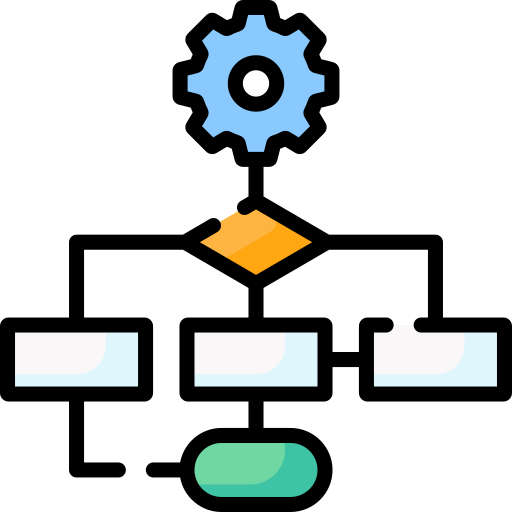
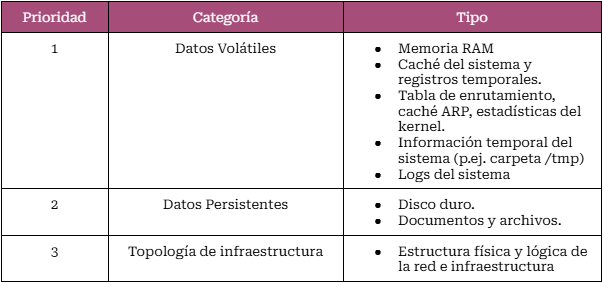
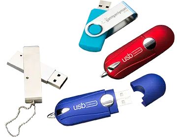
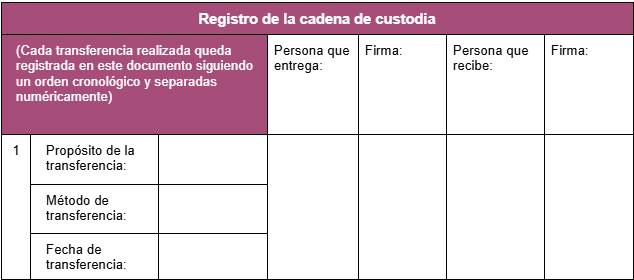
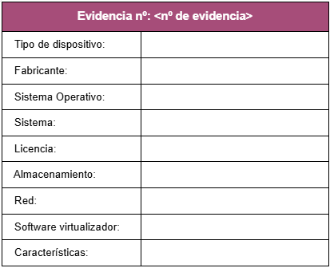
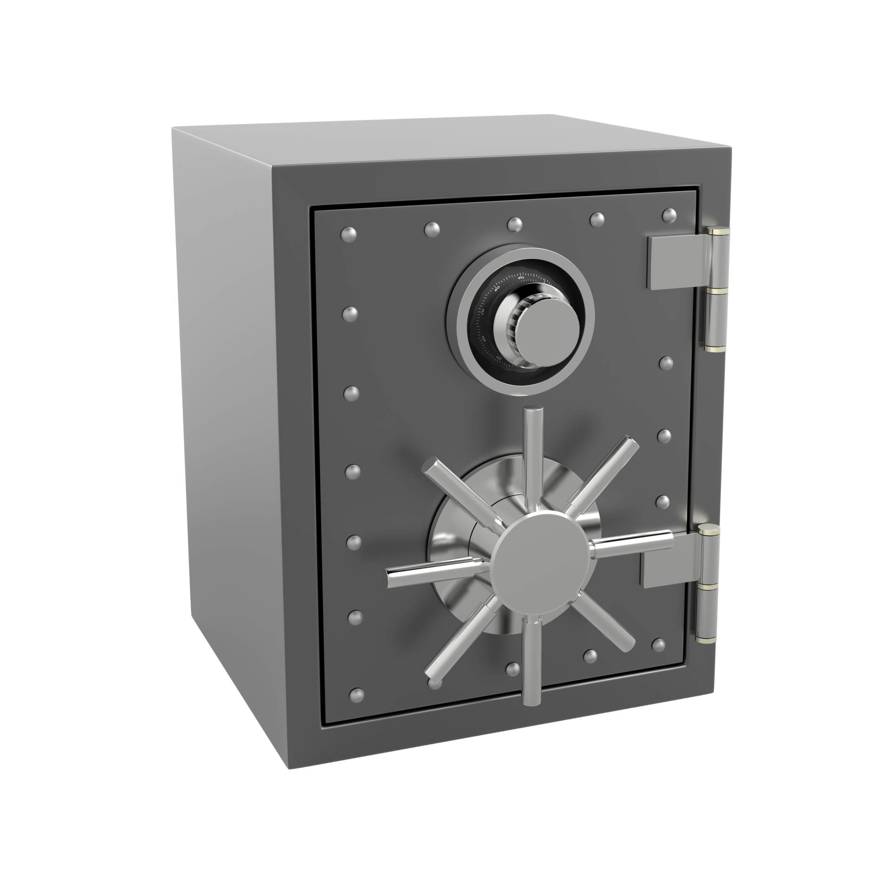
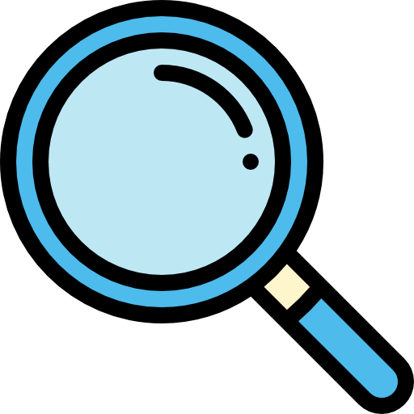
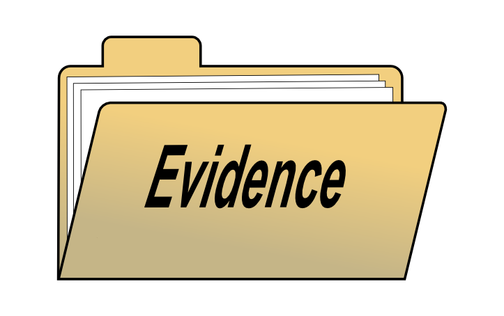
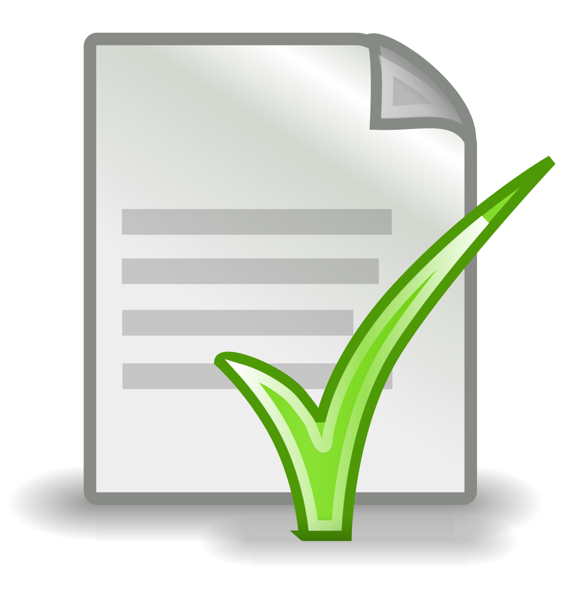
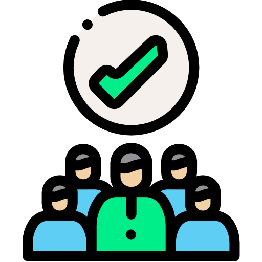

# Proyecto 01 - **Development of a Forensic Analysis Methodology** 🚀

By: David Vila Díaz

---

## Índice

* Análisis de Metodologías (img/ISO Y NIST)
* Comparativa entre ISO y NIST
* Metodología Propia - DVD 0001
    * Estudio e Identificación de la Evidencia
    * Recolección y Adquisición de Datos
    * Preservación y Cadena de Custodia
    * Análisis de Evidencias
    * Documentación y Presentación de Resultados
    * Conclusión

---

### Análisis de Metodologías

¿Cuáles he elegido y por qué?

---

### NIST ☄️

* Recopilación de datos
* Identif. de los datos
* Rpta. a incidentes
* Análisis
* Informe
* Revisión constante

---

### ISO/IEC 27037:2012 💫

* Aspectos Importantes.
    * Proceso Priorización
    * Manejo de Pruebas
    * Cadena de Custodia
    * Tipos Adquisición

---

### Comparativa entre ISO y NIST

* Perspectiva General
* Recolección de Datos
* Identificación y Adquisición de Datos
* Manejo de Pruebas y CoC
* Examen de Datos
* Análisis de Datos
* Elaboración de Informes

---

## Mi Metodología ⋙ DVD 0001

¿Cómo se ha desarrollado?

---

## Fases de la DVD 0001

* Estudio e Identificación de la Evidencia
* Recolección y Adquisición de Datos
* Preservación y Cadena de Custodia
* Análisis de Evidencias
* Informe y Presentación de Resultados

---

#### Estudio e Identificación de la Evidencia

🔧 **Estudio Inicial** 🔧
* Revisión profunda de los datos
* Contacto con partes Involucradas
* Se definen los objetivos del A.F.
* Después, se diseña Plan de Acción
* Asignación de responsabilidades
* Mantener Legalidad e Integridad

---

#### Estudio e Identificación de la Evidencia

🔧 **Identificación de Evidencias** 🔧

* Búsqueda de posibles Pruebas Digitales
* Reconocer y documentar Evidencias Físicas y Lógicas
* Otorgar prioridad por volatilidad (img/Siguiente Tabla)
* Considerar evidencia digital oculta
* Fotografiar/capturar/grabar la escena

---

### Recolección y Adquisición de Datos
##### 1. Identificación y Planificación 🔨
* Fuentes de Datos

* Recolección Constante
* Planificación de la Adquisición

---

### Recolección y Adquisición de Datos
##### 2. Procedimientos de Recolección 🔨
* Consideraciones Iniciales
* Qué No Hacer
* Uso de Herramientas Forenses

---

### Preservación y Cadena de Custodia
##### 1. Preservación de la Evidencia

---

### Preservación y Cadena de Custodia
##### 2. Cadena de Custodia
* Reconocimiento Inicial de la Evidencia
* Identificación y Marcado
* Preservación y Seguridad
* Registro Íntegro
* Control de Accesos
* Transporte de la evidencia

---
### Preservación y Cadena de Custodia
* Presentación Legal

---

### Preservación y Cadena de Custodia
* Presentación Legal

---

### Preservación y Cadena de Custodia
* Presentación Legal

---

### Preservación y Cadena de Custodia
##### 3. Almacenamiento Seguro

---

### Análisis de Evidencias
* Selección de Instrumentos y Herramientas Forenses
* Inspección de Dispositivos y Almacenamiento
* Restauración de Información Eliminada o Corrupta
* Evaluación de Metadatos
* Investigación de Malware y Código Malicioso

---

### Análisis de Evidencias
* Vinculación de Incidentes
* Construcción de una Cronología
* Contextualización de Información
* Determinación de Responsables
* Establecimiento de Conexiones y Motivaciones
* Registro Detallado de Procedimientos

---

### Documentación y Presentación de resultados 🖊️

1. Documentación Profunda de Hallazgos

---

### Documentación y Presentación de resultados 🖊️

2. Preparación y Presentación de Resultados

---

### Documentación y Presentación de resultados 🖊️

3. Elaboración del Informe Final

---

### Documentación y Presentación de resultados  🖊️

4. Acciones Posteriores y Mejora Continua

---

### Documentación y Presentación de resultados 🖊️

5. Actualización y Capacitación del Personal

---

# Conclusion Personal

---

